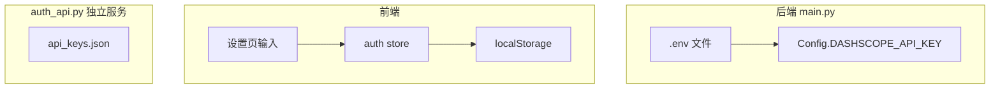
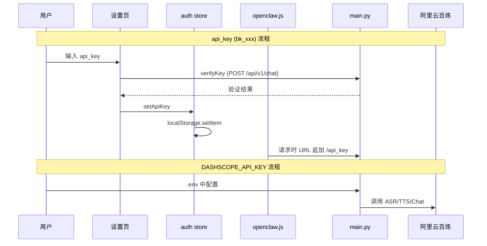

# 当前项目 Key 获取形式确认

## 一、Key 类型总览

项目中有 **4 类** 不同的 Key，用途和获取方式各不相同：



---

## 二、各类 Key 详情

### 1. DASHSCOPE_API_KEY（阿里云百炼 / DashScope）

| 项目 | 说明 |
|------|------|
| **用途** | 调用阿里云百炼 DashScope API（对话、ASR、TTS） |
| **获取** | 在 [阿里云百炼控制台](https://dashscope.console.aliyun.com/) 创建 |
| **存储** | `code/backend/.env` |
| **加载** | `load_dotenv()` → `os.environ.get('DASHSCOPE_API_KEY')` → `Config.DASHSCOPE_API_KEY` |
| **格式** | `sk-` 开头 |
| **使用位置** | `main.py` 中 DashScopeClient、ASR、TTS、openclaw 等 |

```python
# main.py 第 942 行
DASHSCOPE_API_KEY: str = os.environ.get('DASHSCOPE_API_KEY', '')
```

---

### 2. api_key（前端访问后端的 Key，bk_ 格式）

| 项目 | 说明 |
|------|------|
| **用途** | 前端调用 `/api/v1/chat`、`/api/v1/models` 时作为 URL 后缀携带 |
| **获取** | 1) 设置页输入并验证 2) 或由 auth_api 的 `/api/keys` 创建 |
| **存储** | 前端 `localStorage.getItem('api_key')` |
| **格式** | `bk_` + 32 位随机字符（如 `bk_mk-txbVMCSUAjneSBu-...`） |
| **使用位置** | `openclaw.js` 请求拦截器、`openclaw.js` 服务 |

```javascript
// openclaw.js 第 14-21 行
const apiKey = localStorage.getItem('api_key')
if (apiKey && (config.url.includes('/api/chat') || config.url.includes('/api/models'))) {
  config.url = config.url.replace(/\/$/, '') + '/' + apiKey
}
```

**说明**：main.py 的 chat 接口接受 URL 中的 `api_key` 参数，但**未**与 `api_keys.json` 做校验；`api_keys.json` 由独立的 auth_api 服务使用。

---

### 3. api_keys.json 中的 Key（auth_api 专用）

| 项目 | 说明 |
|------|------|
| **用途** | auth_api 独立服务的 API Key 管理（JWT 认证） |
| **获取** | 调用 auth_api 的 `POST /api/keys` 创建 |
| **存储** | `code/backend/api_keys.json`（已加入 .gitignore） |
| **格式** | `bk_` + token_urlsafe(32) |
| **使用位置** | `auth_api.py` 的 `require_api_key`、`/api/auth/token` 等 |

**说明**：auth_api 是独立 Flask 应用，与 main.py 分开运行；当前 start.sh 只启动 main.py，未启动 auth_api。

---

### 4. aliyun_appkey（阿里云语音 App Key）

| 项目 | 说明 |
|------|------|
| **用途** | 阿里云语音相关配置（当前 ASR 走后端，此 Key 可能用于其他语音能力） |
| **获取** | 用户在设置页输入 |
| **存储** | `localStorage.getItem('aliyun_appkey')` |
| **使用位置** | `VoiceInput.vue` 初始化 ASRService、`SettingsView.vue` |

**说明**：当前 ASR 实际调用的是 main.py 的 `/api/v1/asr/recognize`，使用后端的 DASHSCOPE_API_KEY，`aliyun_appkey` 可能为预留或旧逻辑。

---

## 三、数据流示意



---

## 四、总结

| Key 类型 | 存储位置 | 获取方式 |
|----------|----------|----------|
| **DASHSCOPE_API_KEY** | `code/backend/.env` | 阿里云百炼控制台创建，写入 .env |
| **api_key (bk_)** | 前端 localStorage | 设置页输入并验证，或 auth_api 创建 |
| **api_keys.json** | `code/backend/api_keys.json` | auth_api 的 POST /api/keys 创建 |
| **aliyun_appkey** | 前端 localStorage | 设置页输入 |

当前运行的是 main.py，语音识别依赖 **DASHSCOPE_API_KEY**；前端的 **api_key** 用于 chat/models 请求，main.py 未做严格校验。
